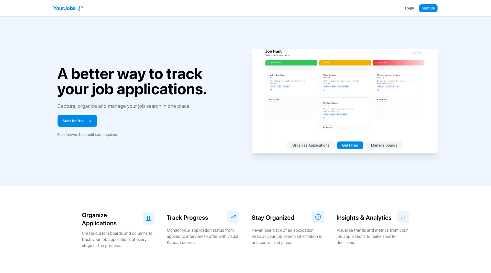

# Job Application Tracker

This project is a **modern Job Application Tracker** built with **Next.js, React and Tailwind CSS**.  
It focuses on a clean UI, responsive layouts, and reusable components, simulating a real-world application dashboard to manage job applications efficiently.

## 🌐 Live Demo

Check out the live demo:  
[](https://job-application-tracker-azure-sigma.vercel.app/)

## [](https://job-application-tracker-azure-sigma.vercel.app/)

> ⚠️ **Note:** Some features like drag-and-drop for job cards are **planned for future implementation**.

---

## 🎯 Project Goals

The main goals of this project are to:

- Provide an intuitive dashboard for tracking job applications
- Allow moving jobs between columns representing different stages
- Create, edit and delete all type of job applications

---

## 🛠️ Technologies & Libraries

### Frontend

- **Next.js** – React framework for server-side rendering and routing
- **React** – UI library
- **Tailwind CSS** – Utility-first responsive styling
- **Framer Motion** – Smooth animations and transitions
- **Lucide React** – SVG icons
- **Zod** – Schema validation for forms (passwords, inputs)
- **Radix UI** – Dropdown menus, labels, modals, and other primitives
- **ShadCN/UI** – Component primitives
- **Sonner** – Toast notifications for user feedback

### Backend & Authentication

- **MongoDB & Mongoose** – Database for storing users, boards, and job applications
- **Better Auth** – Authentication system with secure session handling

---

## 💡 Features

- Hero section with **responsive image carousel** showing app screenshots
- Fully responsive Kanban board to manage job applications by columns
- Job card details include position, company, tags, description, and links
- Real-time toast notifications providing feedback for user actions (create, edit, delete, and board operations)
- Responsive and modern UI

---

## 🚀 Getting Started

Follow these steps to run the project locally:

### Installation

1. Clone the repository:

```bash
git clone https://github.com/andref218/job_application_tracker
cd job_application_tracker
```

2. Install dependencies:

```bash
npm install
```

3. Setup environment variables:
   Create a `.env.local` file at the project root:

```env
MONGODB_URI=your_mongodb_uri_here
BETTER_AUTH_SECRET=your_better_auth_secret_here
BETTER_AUTH_URL=your_better_auth_url_here
NEXT_PUBLIC_BETTER_AUTH_URL=your_next_public_better_auth_url_here
```

## 📂 Project Structure

```text
job_application_tracker/
├── README.md
├── actions/ # Functions handling authentication, job actions, column actions
│ ├── auth.ts
│ ├── board.ts
│ ├── columns.ts
│ └── job-applications.ts
├── app/ # Next.js app routes
│ ├── (auth) # Auth pages
│ ├── (main) # Main dashboard pages
│ ├── api/ # API routes
│ ├── favicon.ico
│ └── globals.css
├── components/ # Reusable components
│ ├── AuthButtons.tsx
│ ├── ClearBoardButton.tsx
│ ├── CreateJobDialog.tsx
│ ├── HeroCarousel.tsx
│ ├── ImageTabs.tsx
│ ├── JobApplicationCard.tsx
│ ├── KanbanBoard.tsx
│ ├── NavBar.tsx
│ ├── SignOutButton.tsx
│ ├── SubmitButton.tsx
│ └── ui/
├── lib/ # Libraries and utilities
│ ├── auth/
│ ├── db.ts
│ ├── hooks/
│ ├── init-user-board.ts
│ ├── models/
│ ├── seed-example-jobs.ts
│ └── utils.ts
├── public/ # Static assets
│ ├── screenshots/
│ ├── file.svg
│ ├── globe.svg
│ ├── next.svg
│ ├── vercel.svg
│ └── window.svg
├── next.config.ts
├── tsconfig.json
├── package.json
└── postcss.config.mjs
```
